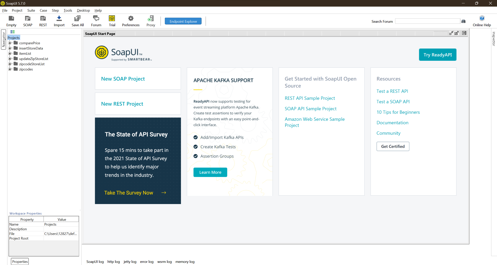

## SoapUI Testing Tools

SOAPUI is a widely used testing tool for web services. It is used to test APIs, SOAP and RESTful web services, and web applications that communicate over HTTP or HTTPS. SOAPUI is an open-source tool that supports the testing of web services across multiple protocols, including HTTP, JMS, AMF, JDBC, and many more. With SOAPUI, you can perform functional testing, load testing, security testing, and mocking of web services. It allows you to test web services by creating requests and responses and examining the results. SOAPUI has a user-friendly interface, and it provides many features such as data-driven testing, test case management, and reporting. SOAPUI also has a Pro version with additional features such as advanced security testing, API monitoring, and service virtualization. It is widely used by software testers, developers, and quality assurance professionals for web service testing.

- SoapUI can be downloaded from the link below

  https://www.soapui.org/downloads/thank-you-for-downloading-soapui/

- Load all test scripts from the folder and view the test result

